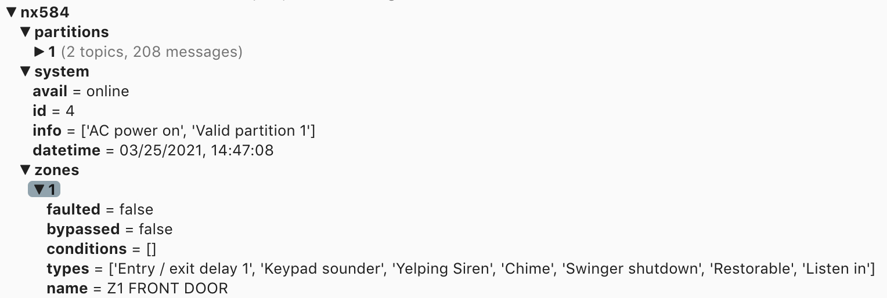

GE/Caddx/NetworX NX584/NX8E Interface Library - MQTT Client & HTTP Server
=========================================================================

This is a tool to let you interact with your GE/Caddx/NetworX alarm panel via
the NX584 module (which is built into NX8E panels). You must enable it
in the configuration of the control panel. 

This package is designed to be a direct replacement for pynx584.
Connection services allow for HTTP server (flask) and/or MQTT client (paho-mqtt).

MQTT provides considerable improvements in zone change latency. Also, since flask is really designed only for development and is considered unstable, HTTP usage is not suggested, but only is provided for backwards-compability.

# Installation Details:

[README](README.rd)

------------------------------------------------
# Improvements:

- Greatly reduced latency for zone and alarm status changes
- Allows for update of alarm time on user request (not just at startup)
- Enhanced security protocol options
- User access to zone and partition flags
- Heartbeat to verify alarm connection is still active

------------------------------------------------
# FUTURE:

- Docker config
- Alter defaults to HA, if needed or desired
- Test MQTT last will and disconnection/reconnection when MQTT server goes offline
- Verify HTTP event stream still functional

------------------------------------------------
# Known Issues:

- At startup, the alarm requests details on all the zones, so it takes about 5 secs per zone. Therefore the alarm may take a minute or two at startup to show online. This time period is extended if HTTP is enabled.

- nx584_client continues to use the HTTP connection method, so server port connect from the client host must be available

------------------------------------------------

# BREAKING CHANGES (minimal from pynx584):

- For pynx584, HTTP was always enabled, and now requires the corresponding input parm to activate if desired.

- Previously, the logs for HTTP connections were always logged to console, and now require log level INFO (not-default)

